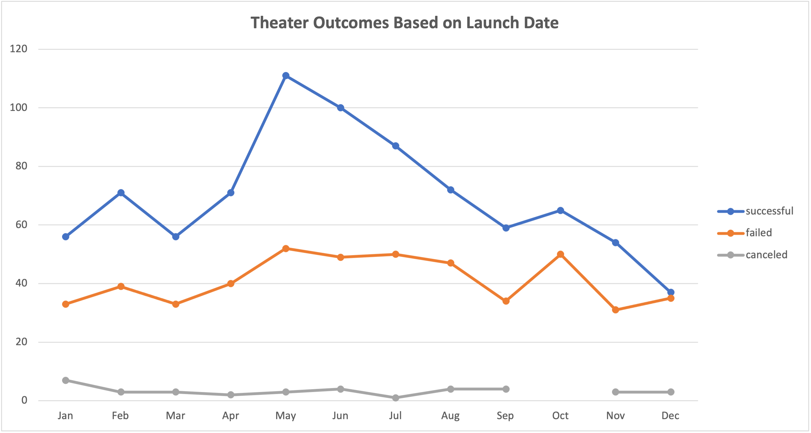
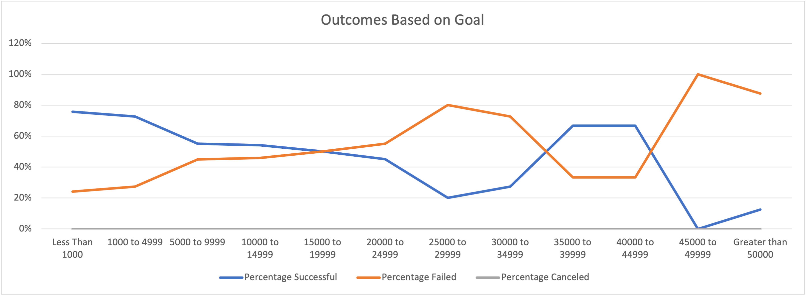

# Kickstarting with Excel

## Overview of Project

### The purpose of this Porject is to organize, sort and analysis the dataset in order to help Louise sucessful organize her own campaign. 

## Analysis and Challenges

### Explain how you performed your analysis using images and links to code, as well as any challenges you encountered and how you overcame them. If you had no challenges, describe any possible challenges or difficulties that could be encountered.

In the analysis of outcomes by launch date, I start of creating a pivot table based on data in Kickstarter spreadsheet.  Then I created a chart based on pivot table info. In the analysis of outcomes based on goals, I first created a table with numbers I need (use countifs and sum function), then I created a pivot chart to reflect those numbers. 

The challenge I have is to use the countif function. That's a complicated function with many criteria involved into it. I'm not able to run the function at first time, so I have to recheck my spelling and eventually it worked out. 

### Analysis of Outcomes Based on Launch Date

### Analysis of Outcomes Based on Goals

### Challenges and Difficulties Encountered

- What are two conclusions you can draw about the Outcomes based on Launch Date?

First, overall there are more successful theater event than the failure ones.  The pivot chart shows the successful line all above the failed line. 
Second, pre summer time(May-June) would be the best time to hose theater event. 

- What can you conclude about the Outcomes based on Goals?

Overall, the goal and percentage failed in the positive correlation, the larger the goal is, the more chance the outcome would be failed.There may be the outlier in the goal of 30,000 to 40,000. 

- What are some limitations of this dataset?

First, the amount of data is limit； overall the dataset only has about 4000 rows, few outlier could easily skew data.
Second, this dataset only considered money and outcome; however, in order to sucessfully host a campaign there are other factors get involve. For example, we don't know how many people need to get involve for hosting a sucessful campaign; we also don't know the preparation time for a campaign. So I feel we are not able to provide a full picture to Louise per this dataset. 

- What are some other possible tables and/or graphs that we could create?

I would want to create a box and wisker chart to show the distribution of funding. I want to highlight the mean and outlier.

###### Thank you for taking time reviewing my analysis.:hibiscus:
